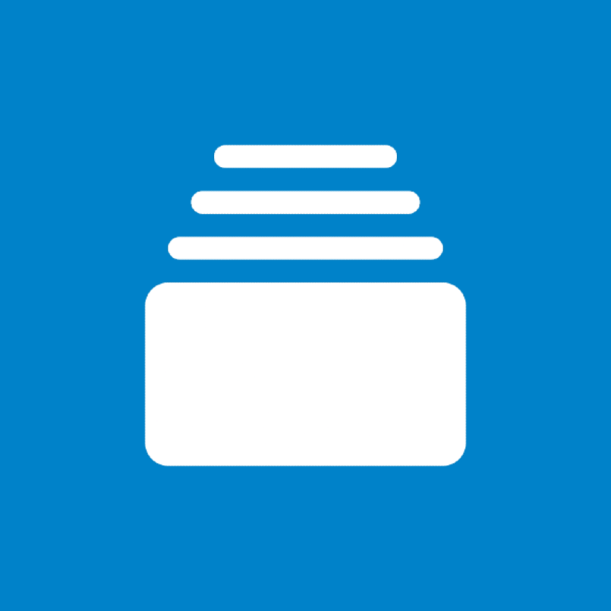
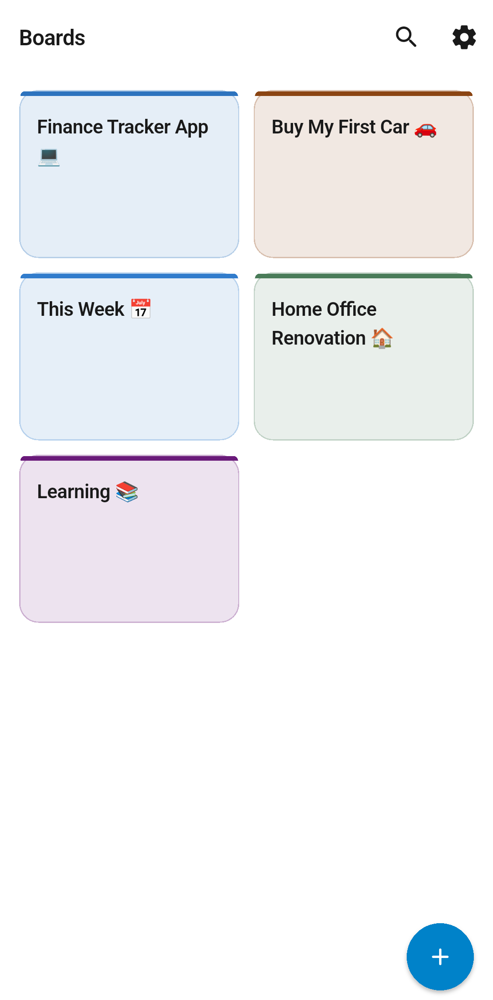
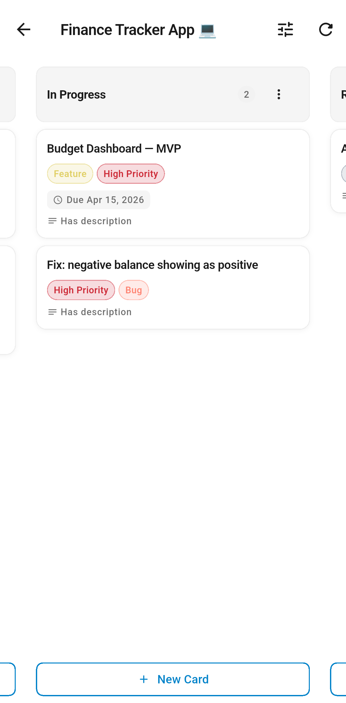
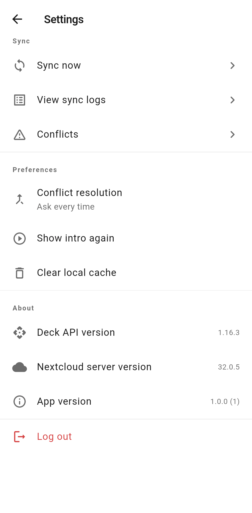

<div align="center">



# Nextcloud Deck

An unofficial mobile client for [Nextcloud Deck](https://github.com/nextcloud/deck), built with **Flutter**. Offline-first, fully localised, and designed to feel native on both Android and iOS.

[](https://flutter.dev)
[](https://flutter.dev)
[](pubspec.yaml)
[](LICENSE)
[](https://github.com/e-atlas-dev/nextcloud_deck/releases/tag/v1.0.0-beta)

</div>

---

## Features

- **Full Kanban board** - horizontal scrolling columns with drag-to-reorder within a stack
- **Offline-first** - all boards, stacks and cards are cached locally; the app is fully usable with no internet connection
- **Nextcloud Login Flow v2** - secure in-app WebView login that retrieves an App Password automatically, without ever touching your main password
- **Offline sync queue** - edits made offline are queued and replayed automatically on reconnect, with up to 5 retries per item
- **Conflict detection** - if another user edits the same card while you're offline, a side-by-side difference lets you choose which version to keep
- **Filters & sorting** - filter by assignee, due date, or overdue; sort by default order, due date, or alphabetically
- **Global search** - searches board titles, stack titles, and card titles/descriptions across all boards
- **Create, edit, delete** boards, stacks and cards; archive/unarchive boards
- **Due date picker** with overdue and due-today colour indicators
- **Label and assignee display** on Kanban cards and the card detail sheet
- **Markdown rendering** in card descriptions
- **Dark mode** following the system setting
- **Sync logs** - timestamped record of every sync operation, queue drain, and conflict resolution
- **Onboarding** - animated 3-page intro on first launch
- Fully localised; all strings in `lib/l10n/app_en.arb`

---

## Screenshots

<div align="center">

| Home | Board List | Settings |
|:---:|:---:|:---:|
|  |  |  |

</div>

**Beta Release:** A debug APK is available on the [Releases page](https://github.com/e-atlas-dev/nextcloud_deck/releases) for testing. 
> It is unsigned - you will need to enable "Install from unknown sources" on your device.

## Getting started

```bash
git clone https://github.com/e-atlas-dev/nextcloud_deck.git
cd nextcloud_deck
flutter pub get
flutter run
```

Requires **Flutter stable 3.27+** and **Dart 3.3+**.

### Android

Add to `android/app/src/main/AndroidManifest.xml`:

```xml
<uses-permission android:name="android.permission.INTERNET" />
```

### iOS

No additional permissions required.

---

## Architecture

```
lib/
├── core/
│   ├── constants/       API paths, Hive type IDs, key constants
│   ├── errors/          Sealed AppException hierarchy
│   ├── network/         ApiClient - Basic Auth, error mapping, JSON parsing
│   ├── storage/         HiveService, SecureStorageService
│   ├── theme/           AppColors palette, AppTheme light/dark ThemeData
│   └── utils/           ConnectivityService, DateFormatter
├── data/
│   ├── models/hive/     Hive models + TypeAdapters (no code-gen)
│   ├── repositories/    BoardsRepository - server ↔ cache ↔ domain
│   └── services/        AuthService, DeckApiService, SyncQueueService
├── domain/
│   └── entities/        DeckBoard, DeckStack, DeckCard, DeckLabel, DeckUser
├── presentation/
│   ├── providers/       Riverpod providers (auth, boards, settings, infra DI)
│   ├── screens/         splash → onboarding → login → boards → kanban → …
│   └── widgets/         Kanban card, dialogs, sheets, offline banner
├── router/              GoRouter with auth redirect guard
└── main.dart
```

| Concern | Approach |
|---|---|
| State management | Riverpod `AsyncNotifier` + `Notifier` - no `setState` in business logic |
| Navigation | `go_router` with a `refreshListenable` auth guard |
| Caching | Hive CE with hand-written `TypeAdapter`s |
| Credentials | `flutter_secure_storage` only - never in Hive, never in logs |
| Offline sync | FIFO Hive-backed queue; drains on reconnect, 5-retry limit with abandon log |
| Conflict resolution | `lastModified` comparison; Hive-stored; resolved via dedicated screen |

---

## Authentication

Uses [Nextcloud Login Flow v2](https://docs.nextcloud.com/server/latest/developer_manual/client_apis/LoginFlow/index.html):

1. User enters their Nextcloud server URL.
2. An in-app WebView opens the Nextcloud login page.
3. After sign-in, Nextcloud generates a dedicated App Password for this client.
4. The App Password is stored in the platform Keychain (iOS) or Android Keystore via `flutter_secure_storage`. The main password is never seen or stored by the app.

---

## Dependencies

| Package | Purpose |
|---|---|
| `flutter_riverpod` | State management |
| `go_router` | Navigation |
| `hive_ce` + `hive_ce_flutter` | Local caching |
| `flutter_secure_storage` | Credential storage |
| `http` | HTTP client |
| `connectivity_plus` | Online/offline detection |
| `webview_flutter` | Login Flow v2 |
| `flutter_markdown_plus` | Card description rendering |
| `uuid` | Sync queue entry IDs |
| `intl` | Date formatting + localisation |
| `package_info_plus` | App version display |

---

## Internationalisation

All strings live in `lib/l10n/app_en.arb`. To add a language:

1. Create `lib/l10n/app_XX.arb` with the same keys, translated values.
2. Run `flutter pub get` - localisation classes are regenerated automatically (`generate: true` in `pubspec.yaml`).

---

## Contributing

Pull requests are welcome. For significant changes please open an issue first to discuss the approach.

---

## Known limitations

- Background sync is not implemented - sync runs on app open and via the manual "Sync now" button.
- Card attachments and comments are not yet supported (the Deck API supports them; the extension point is `DeckApiService`).

---

## Disclaimer

This project is not affiliated with or endorsed by Nextcloud GmbH. "Nextcloud" and the Nextcloud logo are trademarks of Nextcloud GmbH.

---

## License

[AGPL-3.0](LICENSE)
